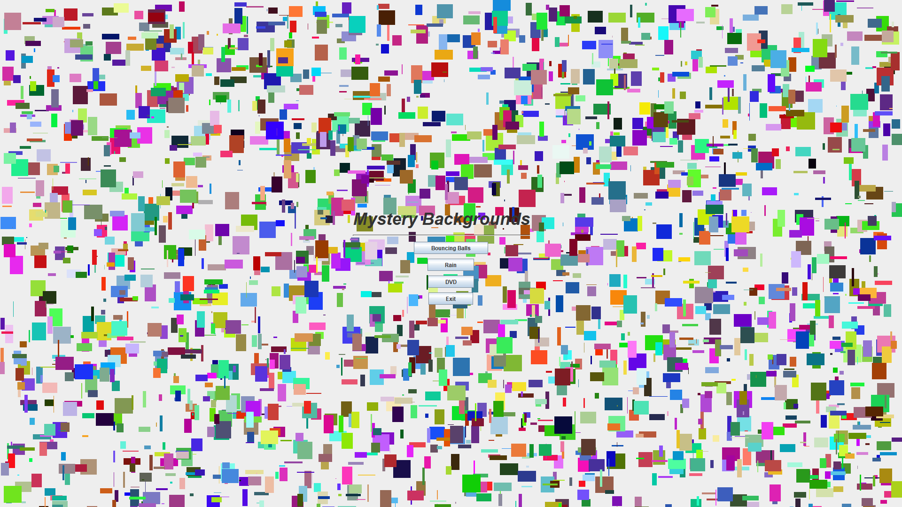
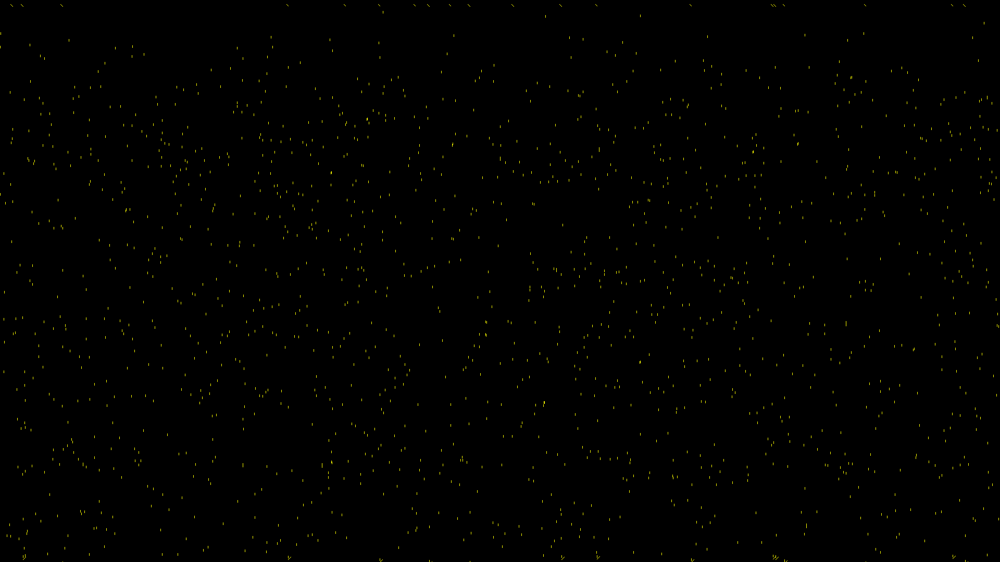
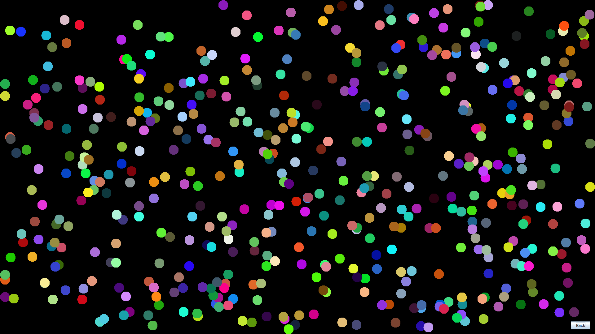

<h1>Brief Description</h1>

This Project was created in the Spring of 2019 for a Senior Project class I took during my Undergraduate years. The purpose of this project was to be a refresher on Java and learn GUI's. The goal of the project was to create 90s/00s screen savers.

<h2>What This Project Contains</h2>

This Project contains 3 different backgrounds and a main menu.
Files Assocatied with Main Project:

<ul>
  <li>BallAnimation4.java</li>
  <li>DVD.java</li>
  <li>Frame.java</li>
  <li>movingRectangle.java</li>
  <li>panel.java</li>
  <li>Rectangle.java</li>
  <li>splash.java</li>
  <li>Star.java</li>
  <li>TimedExit.java</li>
</ul>

Other than the main project there are some side projects that were created to help learn GUI's.
Files Assocatied with Side Projects:

<ul>
  <li>Display.java</li>
  <li>DrawEverything.java</li>
  <li>Drop.java</li>
  <li>Jswingtut.java</li>
  <li>MainFunction.java</li>
  <li>Rain.java</li>
</ul>

<h2>How to Run Project</h2>

The panel.java file created the panels for the main menu, run this file to start the project.

<h2>Know Bugs</h2>

There is no exit button for the rain background, so you have to nmanually close the java exe that is created.

<h3>Main Menu</h3>
</img>
<h3>Rain</h3>
</img>
<h3>Bouncing Balls</h3>
</img>
<h3>DVD</h3>
</img>
